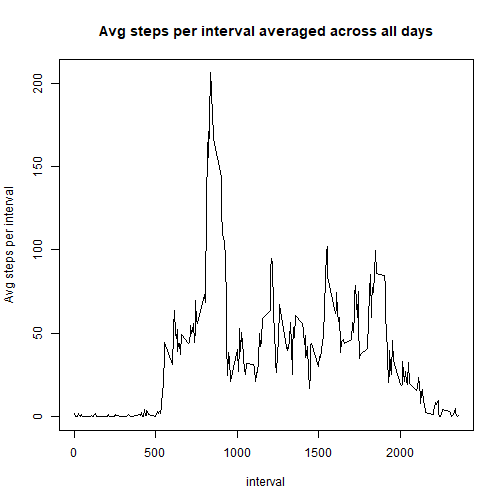

#**1.Code for reading in the dataset and/or processing the data**  
##Reading the .csv file and setting the correct date format

```r
data = read.csv(unz('data.zip', 'activity.csv'))
data$date = as.Date(data$date, format = '%Y-%m-%d')
```

##Loading the required packages from library

```r
library(dplyr)
library(ggplot2)
```

#**2.Histogram of the total number of steps taken each day**

```r
stepspd = data %>% group_by(date) %>% summarise(spd = sum(steps, na.rm = T))
hist(stepspd$spd, xlab = 'steps per day',
     main = 'Histogram of steps per day')
```



#**3.Mean and median number of steps taken each day**

```r
print(paste('mean steps per day', mean(stepspd$spd), sep = ' = '))
```

```
## [1] "mean steps per day = 9354.22950819672"
```

```r
print(paste('median number of steps per day', median(stepspd$spd), sep = ' = '))
```

```
## [1] "median number of steps per day = 10395"
```

#**4.Time series plot of the average number of steps taken**

```r
stepspi = data %>% group_by(interval) %>% summarise(spi = mean(steps, na.rm = T))
with(stepspi, plot(interval, spi, type = 'l',
                   ylab = 'Avg steps per interval',
                   main = 'Avg steps per interval averaged across all days'))
```


#**5.The 5-minute interval that, on average, contains the maximum number of steps**

```r
print(paste('interval with max number of steps', stepspi[stepspi$spi == max(stepspi$spi),'interval'], sep = ' = '))
```

```
## [1] "interval with max number of steps = 835"
```

##checking for number of NA values

```r
print(paste('number of NA values', sum(is.na(data$steps)), sep = ' = '))
```

```
## [1] "number of NA values = 2304"
```

#**6.Code to describe and show a strategy for imputing missing data**  
##Here we will fill the NA values with the average value of that interval averaged across all days

```r
stepsna = data
stepsna = merge(stepsna, stepspi, by.x = 'interval', by.y = 'interval', all.x = T)
stepsna[is.na(stepsna$steps), "steps"] = stepsna[is.na(stepsna$steps), "spi"]
stepsna$spi = NULL
```

#**7.Histogram of the total number of steps taken each day after missing values are imputed**

```r
stepspdna = stepsna %>% group_by(date) %>% summarise(spd = sum(steps))
hist(stepspdna$spd, xlab = 'steps per day',
     main = 'Histogram of steps per day after filling NA values')
```


```r
print(paste('mean steps per day after imputing NAs', mean(stepspdna$spd), sep = ' = '))
```

```
## [1] "mean steps per day after imputing NAs = 10766.1886792453"
```

```r
print(paste('median number of steps per day after imputing NAs', median(stepspdna$spd), sep = ' = '))
```

```
## [1] "median number of steps per day after imputing NAs = 10766.1886792453"
```

#**8.Panel plot comparing the average number of steps taken per 5-minute interval across weekdays and weekends**  
##creating a factor variable 'day' with levels weekday/weekend

```r
stepsna = stepsna %>% mutate(day = weekdays(date))
stepsna$day = gsub('^(Monday|Tuesday|Wednesday|Thursday|Friday)', 'weekday', stepsna$day)
stepsna$day = gsub('^(Saturday|Sunday)', 'weekend', stepsna$day)
stepsna$day = as.factor(stepsna$day)
```

##Calculating the average num of steps averaged on day and interval

```r
stepspina = stepsna %>% group_by(day, interval) %>% summarise(spi = mean(steps))
```

##plotting

```r
ggplot(data = stepspina, aes(x = interval, y = spi)) +
      geom_line() +
      facet_grid(day~., scales = 'free') +
      ylab('Average steps') +
      ggtitle('Avg steps per interval averaged across weekday/weekend')
```


